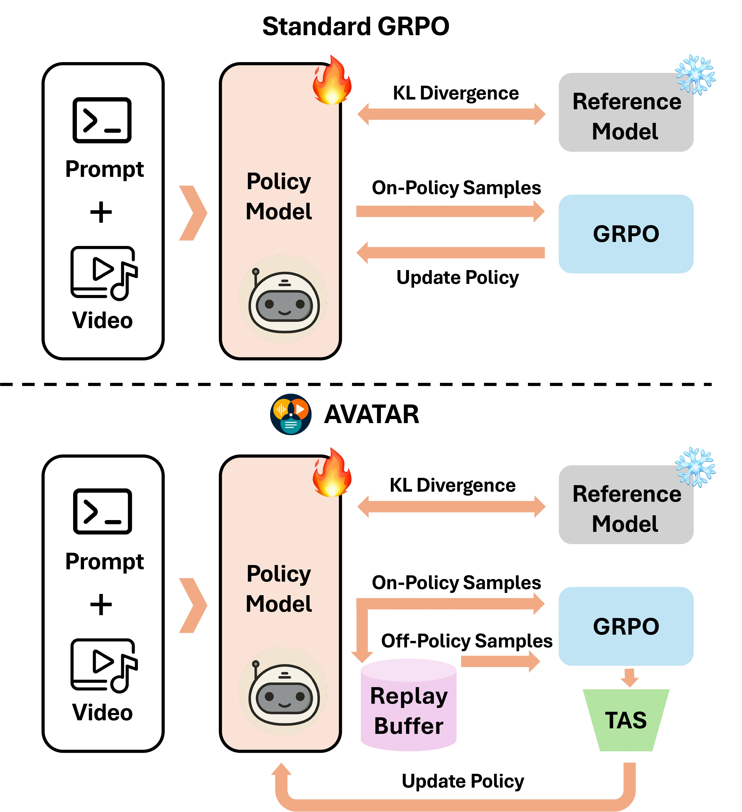

</think>

<h2 align="center"> <a href="https://arxiv.org/abs/2508.03100">AVATAR: Reinforcement Learning to See, Hear, and Reason Over Video
</a></h2>
<h3 align="center">CVPR 2026</h3>
<div align="center">


<br>


<a href='https://arxiv.org/abs/2508.03100'></a> &nbsp;
 <a href='https://people-robots.github.io/AVATAR/'></a>&nbsp;
 <a href='https://huggingface.co/yogkul2000/AVATAR'></a> 
 <a href='https://huggingface.co/datasets/yogkul2000/AVATAR-RL-dataset'></a> 

 
 </div>

## Abstract
Multimodal reasoning over long-horizon video is challenging due to the need for precise spatiotemporal fusion and alignment across modalities. While recent methods such as Group Relative Policy Optimization (GRPO) have shown promise in this domain, they suffer from three key limitations: (1) data inefficiency from their on-policy design, (2) a vanishing advantage problem, where identical or near-identical rewards within a group eliminate the learning signal by producing zero-valued advantages, and (3) uniform credit assignment that fails to emphasize critical reasoning steps.

We introduce AVATAR (Audio-Video Agent for Alignment and Reasoning), a framework that addresses these limitations through two core components: (1) an off-policy training architecture that improves sample efficiency and resolves vanishing advantages by reusing past experiences with greater reward diversity, and (2) Temporal Advantage Shaping (TAS), a novel credit assignment strategy that upweights key reasoning phases during learning.

AVATAR achieves strong performance across various benchmarks, outperforming the Qwen2.5-Omni baseline by +5.4 on MMVU, +4.9 on OmniBench, and +4.5 on Video-Holmes, while demonstrating over 35% higher sample efficiency. These results demonstrate that targeted RL improvements, rather than massive architectural changes, effectively address core multimodal reasoning challenges.

<table class="center">
    <tr>
        <td align="center">
            
        </td>
    </tr>
    <tr>
        <td align="center"><em>Overview of the AVATAR.</em></td>
    </tr>
</table>

## 🧰 TODO
- [x] Release Paper.
- [x] Release AVATAR reasoning model fine-tuned model weights.
- [x] Release Inference Code.
- [x] Release eval scripts for all benchmarks.
- [x] Stage wise training data.
- [x] Release GRPO Trainer with TAS.

## 📦 Install

### Environment Setup

```bash
conda create -n avatar python=3.10
conda activate avatar

# Install PyTorch with CUDA 12.6
pip install torch==2.7.1 torchvision==0.22.1 torchaudio==2.7.1 --index-url https://download.pytorch.org/whl/cu126

# Install flash attention (if facing issues, use the command below)
pip install flash-attn==2.7.4.post1

# If flash-attn installation fails, try:
pip install flash-attn==2.7.4.post1 --no-build-isolation

pip install transformers==4.54.1

# Install other dependencies
pip install decord opencv-python pillow numpy
pip install qwen-omni-utils[decord] -U
```

### MS-Swift Setup

```bash
cd ms-swift
pip install -e .
```

### Individual Benchmark Evaluation
All evaluation scripts are located in the `eval` folder. Dataset paths within these scripts are currently hardcoded and must be updated to your local directory.

## 🚀 Training AVATAR (GRPO + TAS + Replay)

Use the provided script and edit paths/flags as needed:

```bash
bash ms-swift/examples/train/grpo/qwen2_5_omni/grpo.sh
```

## 🔧 Parameters (AVATAR-Specific)

These parameters control AVATAR behavior. Defaults reflect the AVATAR implementation in this repo.

1. Replay
   - `--tas_enable`: Enables replay + TAS logic.
   - `--tas_replay_buffer_size`: Total buffer size (stratified).
   - `--tas_replay_min_size`: Minimum buffer size before off-policy replay starts.
   - `--tas_on_policy_batches`: On-policy batches per rollout cycle.
   - `--tas_off_policy_batches`: Off-policy batches per rollout cycle.
   - `--steps_per_generation`: Total batches per rollout cycle. Must equal `on_policy + off_policy`.

2. VCRS (advantage normalization for replay)
   - `--tas_vcrs_window`: Moving window size for per-prompt reward statistics.
   - `--tas_off_policy_alpha`: Scaling factor for off-policy advantages.

3. TAS (Temporal Advantage Shaping)
   - `--tas_lambda`: Strength of temporal weighting (higher = more emphasis on later steps).

4. Hinting
   - `--tas_hint_key`: Dataset field containing the hint string.
   - `--tas_hint_zero_patience`: Apply hint after N consecutive zero-reward attempts for the same prompt.
   - `--tas_hint_always`: Force hints on every sample.
   - `--tas_hint_reward_threshold`: Apply hint if average reward is below threshold.
   - `--tas_hint_kl_threshold`: Apply hint if KL is above threshold.

5. Logging
   - During training you should see logs like:
     - `[AVATAR] replay=1 on=4 off=4 buffer=XXXX vcrs_prompts=YYY`
   - `replay=1` indicates off-policy samples were mixed into the current rollout cycle.

## 🧪 Stage-wise Training (Paper)

The paper runs three stages with different reward signals. Run them as separate jobs.

1. Stage 1 (Accuracy + Format)
   - `--reward_funcs custom_accuracy_reward custom_format_reward`
   - `--reward_weights 1 0.5`

2. Stage 2 (Self-Consistency / Rself)
   - `--reward_funcs self_reward custom_format_reward`
   - `--reward_weights 1 0.5`

3. Stage 3 (Judge Reward)
   - `--reward_funcs judge_reward custom_format_reward`
   - `--reward_weights 1 0.5`
   - Requires InternVL3 model for judging. Set `INTERNVL3_PATH` if using a local checkpoint.

## 📝 Citation
If you find AVATAR useful for your research, please cite our paper:
```bib
@inproceedings{kulkarni2026avatar,
  title={AVATAR: Reinforcement Learning to See, Hear, and Reason Over Video},
  author={Kulkarni, Yogesh and Fazli, Pooyan},
  booktitle={IEEE/CVF Conference on Computer Vision and Pattern Recognition (CVPR)},
  year={2026}
}
```

## 📪 Contact
For questions about the paper, please contact Yogesh Kulkarni at `ykulka10@asu.edu`. You can also open an issue in this GitHub repository for bugs or specific questions related to the code.
